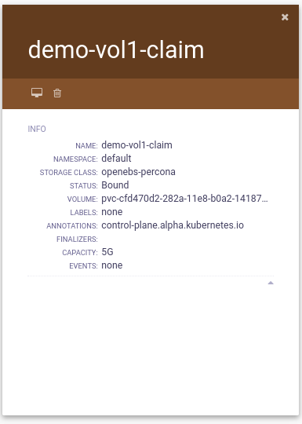

# Persistent Volume Claim details and its json-data.



```
{
  "node": {
    "id": "cfd470d2-282a-11e8-b0a2-141877a4a32a",
    "label": "demo-vol1-claim",
    "rank": "/demo-vol1-claim",
    "shape": "circle",
    ...
```
 Defining matadata for pvc like  its name and all.
```
    ...
    
    "metadata": [
      {
        "id": "Name",
        "label": "Name",
        "value": "demo-vol1-claim",
        "priority": 1.0
      },
      {
        "id": "Namespace",
        "label": "Namespace",
        "value": "default",
        "priority": 2.0
      },
      {
        "id": "StorageClass",
        "label": "Storage Class",
        "value": "openebs-percona",
        "priority": 3.0
      },
      {
        "id": "Status",
        "label": "Status",
        "value": "Bound",
        "priority": 5.0
      },
      {
        "id": "Volume",
        "label": "Volume",
        "value": "pvc-cfd470d2-282a-11e8-b0a2-141877a4a32a",
        "priority": 6.0
      },
      {
        "id": "Labels",
        "label": "Labels",
        "value": "none",
        "priority": 7.0
      },
      {
        "id": "Annotations",
        "label": "Annotations",
        "value": " control-plane.alpha.kubernetes.io",
        "priority": 8.0
      },
      {
        "id": "Finalizers",
        "label": "Finalizers",
        "value": "",
        "priority": 9.0
      },
      {
        "id": "Capacity",
        "label": "Capacity",
        "value": "5G",
        "priority": 10.0
      },
      {
        "id": "Events",
        "label": "Events",
        "value": "none",
        "priority": 11.0
      }
    ],
    ...
```
Defining control buttons for pvc.
```
    ...
    "controls": [
      {
        "probeId": "4fb450295ce9cea3",
        "nodeId": "d053c222-282a-11e8-b0a2-141877a4a32a;<pod>",
        "id": "kubernetes_delete_pod",
        "human": "Delete",
        "icon": "fa-trash-o",
        "rank": 1
      },
      {
        "probeId": "4fb450295ce9cea3",
        "nodeId": "d053c222-282a-11e8-b0a2-141877a4a32a;<pod>",
        "id": "kubernetes_get_logs",
        "human": "Get logs",
        "icon": "fa-desktop",
        "rank": 0
      }
    ]
  }
}
```